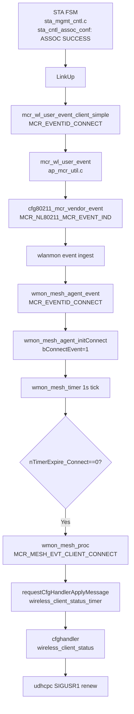

# Agent `MCR_EVENTID_CONNECT` 주체/드라이버 상태머신 분석

## 목적
- `MCR_EVENTID_CONNECT`가 **누가 발생시키는지**를 코드로 확인
- 특히 `mt_wifi7` 드라이버의 STA 연결 상태머신에서 이벤트가 어떻게 올라오는지 정리
- WAPP 이벤트(`MCR_EVENT_REASON_MESH_WAPP_*`)와의 역할 분리

---

## 결론 (한 줄)
- `MCR_EVENTID_CONNECT`의 직접 발생 주체는 **mt_wifi7 STA 연결 FSM 경로**(또는 supplicant ctrl 변환 경로)이고,
- WAPP는 `MCR_EVENTID_EASY_MESH` reason 이벤트를 보내며 CONNECT를 **직접 fire 하진 않는다**.

---

## 1) 드라이버에서 `MCR_EVENTID_CONNECT`가 실제로 발생하는 위치

## 1-1. STA 연결 성공 시점 (FSM)
- 파일: `mt_wifi7/mt_wifi/common/fsm/sta_mgmt_cntl.c`
- 흐름(연결 성공 분기):
  1. `sta_cntl_assoc_conf()`에서 `Reason == MLME_SUCCESS`
  2. `LinkUp(pAd, BSS_INFRA, wdev, ...)` 호출
  3. LinkUp 진행 중 아래 이벤트 송신 함수 호출:
     - `mcr_wl_user_event_client_simple(..., MCR_EVENTID_CONNECT, MCR_EVENT_REASON_CONNECT_ASSOC, ..., Elem)`

즉, **ASSOC 성공 -> LinkUp -> MCR CONNECT 이벤트 송신** 구조다.

## 1-2. 이벤트 패킹/송신 함수
- 파일: `mt_wifi7/mt_wifi/ap/ap_mcr_util.c`
- 주요 함수:
  - `mcr_wl_user_event_client_simple()`  
    -> 내부에서 `mcr_wl_user_event(..., nClientDevIndex = pNetDevClient->ifindex, ...)` 호출
  - `mcr_wl_user_event()`  
    - `mcr_wl_event_set_Header()`로 헤더 생성
    - `header.EventId = MCR_NL80211_MCR_EVENT_IND`
    - `header.SubEventId = nMCREventID` (여기서 CONNECT=10)
    - client면 `header.Reason |= MCR_EVENT_OPMODE_CLIENT`
    - 마지막에 `cfg80211_mcr_vendor_event(...)`로 vendor event 송신

정리하면, **드라이버는 cfg80211 vendor event (`MCR_NL80211_MCR_EVENT_IND`)로 CONNECT를 올린다.**

---

## 2) `MCR_EVENTID_CONNECT` 상수/Reason 정의
- 파일: `mt_wifi7/mt_wifi/include/mcr_wl_event_drv.h`
- 정의:
  - `MCR_EVENTID_CONNECT = 10`
  - `MCR_EVENT_REASON_CONNECT_ASSOC = 0`
  - `MCR_EVENT_REASON_CONNECT_REASSOC = 1`
  - `MCR_NL80211_MCR_EVENT_IND = 103`

---

## 3) wlanmon에서 이 이벤트를 어떻게 사용하나

- 파일: `mcr-wlanmon/src/mtk/mtk_mesh.c`
- 함수: `wmon_mesh_agent_event()`
  - `msgType == MCR_EVENTID_CONNECT` 수신 시
    - `wmon_mesh_agent_initConnect(..., 1, devName)` (connect 플래그 set)
    - `wmon_mesh_agent_initDisconnect(..., 0, devName)` (disconnect clear)
- 이후 `wmon_mesh_timer()`에서 `nTimerExpire_Connect` 만료 시
  - `wmon_mesh_proc(..., MCR_MESH_EVT_CLIENT_CONNECT, NULL)` 실행
  - `wireless_client_status_timer` apply 전달
  - cfghandler에서 `udhcpc` renew(SIGUSR1) 경로로 연결

---

## 4) WAPP 이벤트와의 관계 (중요)

WAPP는 별도 이벤트를 fire 한다:
- 예: `MCR_EVENT_REASON_MESH_WAPP_WPS_START`, `..._WPS_OVERLAP`, `..._SET_BH_PROFILE`
- 실제 코드:
  - `wappd/common/wapp_cmm.c`  
    `system("wcli -i ra0 usercmd 1 25 0")` // WPS_START
  - `wappd/wps/wps.c`  
    `system("wcli -i ra0 usercmd 1 25 3")` // WPS_OVERLAP
  - `wappd/map/map_1905.c`  
    `system("wcli -i ra0 usercmd 1 25 6")` // SET_BH_PROFILE

여기서 `25`는 `MCR_EVENTID_EASY_MESH`에 해당한다.

따라서:
- **WAPP -> EASY_MESH reason 이벤트**는 맞다.
- 하지만 **`MCR_EVENTID_CONNECT` 자체는 드라이버 STA 연결 FSM 쪽에서 생성**된다.
- WAPP는 연결을 유도할 수 있지만 CONNECT를 직접 대체하지는 않는다.

---

## 5) 상태머신 관점 요약

1. `sta_mgmt_cntl.c`  
   - ASSOC/Auth/Join 제어 상태머신 수행
2. ASSOC 성공 시 `LinkUp()`
3. `LinkUp` 경로에서 `mcr_wl_user_event_client_simple(...CONNECT...)`
4. `ap_mcr_util.c`에서 header 구성 후 `cfg80211_mcr_vendor_event(...)`
5. `wlanmon_mtk`/이벤트 경로로 전달
6. `mtk_mesh.c`에서 connect flag set -> timer 만료 후 mesh connect 처리

즉, 질문하신 대로 **상태머신 기반으로 연결 이벤트가 생성/전파**되는 구조가 맞다.

---

## 6) 실무 확인 포인트

1. 드라이버 로그:
   - `sta_cntl_assoc_conf()`에서 `Association successful` / `LinkUp` 로그
2. 이벤트 레벨:
   - `SubEventId = MCR_EVENTID_CONNECT` 수신 여부
3. wlanmon:
   - `wmon_mesh_agent_initConnect(...,1,...)` 호출 여부
   - `MCR_MESH_EVT_CLIENT_CONNECT` 발생 여부
4. cfghandler:
   - `wireless_client_status_timer` -> `wireless_client_status`
   - `udhcpc SIGUSR1` renew 여부

---

## 7) 한눈에 보는 Flow Diagram

### 7-1. Driver CONNECT 이벤트 -> renew 경로

### 7-2. WAPP 이벤트와 CONNECT 이벤트 관계

```mermaid
flowchart LR
    W1[WAPP<br/>MESH_WAPP_WPS_START/SET_BH_PROFILE] --> W2[MCR_EVENTID_EASY_MESH<br/>Reason 25:x]
    W2 --> W3[wlanmon mtk_mesh<br/>EASY_MESH 분기 처리]

    D1[Driver STA LinkUp] --> D2[MCR_EVENTID_CONNECT]
    D2 --> D3[wlanmon mtk_mesh<br/>CONNECT 분기 처리]
    D3 --> D4[CLIENT_CONNECT timer path]
    D4 --> D5[wireless_client_status -> renew]

    W3 -. 간접적으로 연결유도 가능 .-> D1
```

