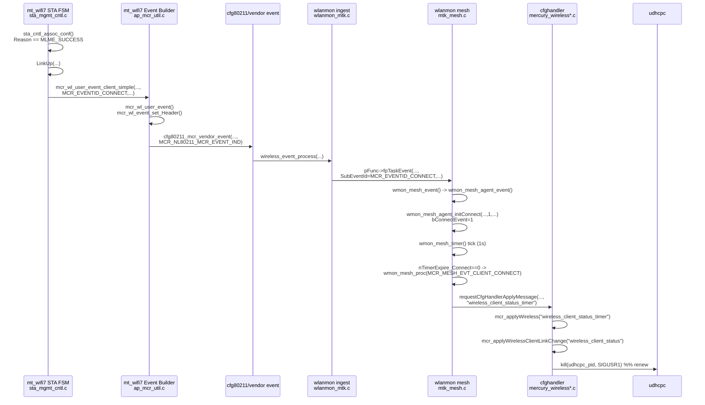
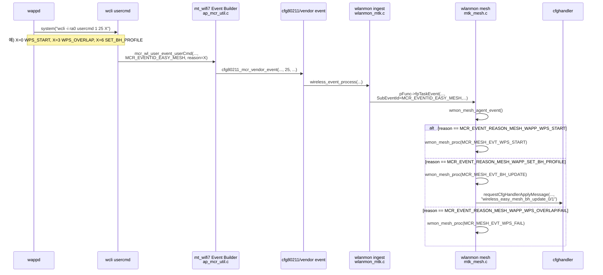
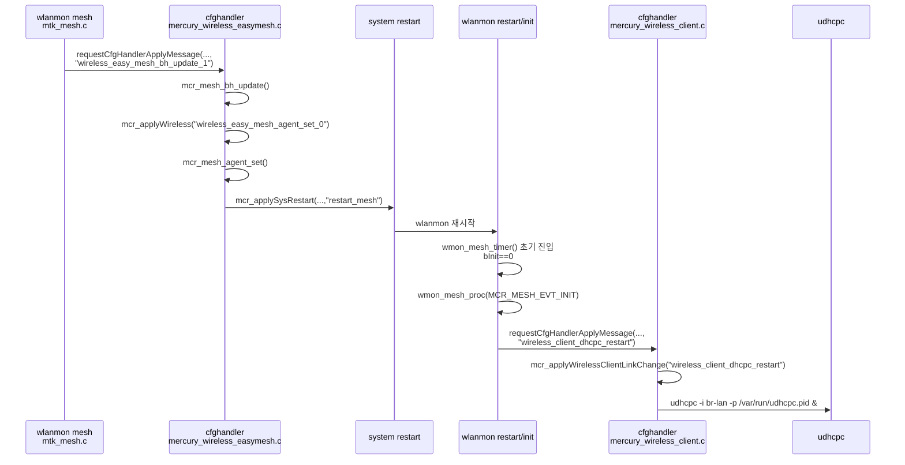

# Driver/Daemon 이벤트 상호작용 다이어그램 (함수명 포함)

## 목적
- `mt_wifi7` 드라이버, `wappd`, `wlanmon`, `cfghandler` 사이의 이벤트 송수신을
  **함수명 기준**으로 한눈에 확인한다.

---

## 1) Station 연결 시 `CONNECT -> renew` 경로

---

## 2) WAPP EasyMesh 이벤트 경로 (`MCR_EVENTID_EASY_MESH`)

---

## 3) `br-lan` IP 재할당(재시작 기반) 경로

---

## 4) 핵심 포인트
- `MCR_EVENTID_CONNECT` 직접 발생 주체: **드라이버 STA FSM(LinkUp 경로)** 또는 supplicant ctrl 변환 경로.
- `MCR_EVENTID_EASY_MESH` reason(`MESH_WAPP_*`) 주체: **wappd usercmd 경로**.
- WAPP 이벤트는 온보딩/WPS/BH 상태를 알리고, CONNECT는 실제 링크 업 이벤트를 반영한다.

