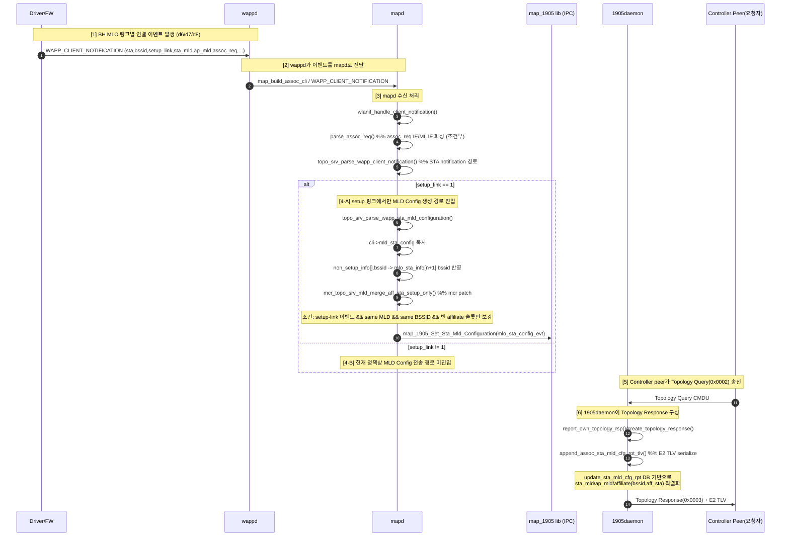

# MLO Backhaul Topology Response 시퀀스

컨트롤러가 Topology Response(0x0003)를 보낼 때, MLO backhaul SSID에 연결된 링크 STA(d6/d7/d8)가 E2 TLV에 실리는 과정을 데몬/함수 단위로 정리한다.

## End-to-End Sequence

## 단계별 핵심 함수

- `wappd`
  - `map_build_assoc_cli` (mapd로 client notification 전달)
- `mapd`
  - `wlanif_handle_client_notification`
  - `parse_assoc_req` (`wapp_if.c`에서 호출, 구현은 `topologySrv.c`)
  - `topo_srv_parse_wapp_client_notification`
  - `topo_srv_parse_wapp_sta_mld_configuration` (setup-link 기준)
  - `mcr_topo_srv_mld_merge_aff_sta_setup_only` (setup-link 표 보강)
  - `map_1905_Set_Sta_Mld_Configuration` (1905 lib 전달)
- `1905daemon`
  - `update_sta_mld_cfg_rpt` (내부 DB 갱신 경로)
  - `report_own_topology_rsp` / `create_topology_response`
  - `append_assoc_sta_mld_cfg_rpt_tlv` (E2 직렬화)

## 로그 대조 포인트

- `mapd`
  - `MCR BSOH DBG5: wapp_if client notif ...`
  - `MCR BSOH DBG5: wappEvent parse notif ...`
  - `MCR BSOH DBG7: topo_srv_parse_wapp_sta_mld ->1905 ...`
  - `MCR BSOH DBG7: merge_setup_only ...` (mcr patch 동작 시)
- `1905daemon`
  - `LIB_STA_MLD_CONFIG_REPORT ...`
  - `append_assoc_sta_mld_cfg_rpt_tlv ...`

## 정리

- E2(Associated STA MLD Config)는 최종적으로 1905daemon이 serialize하지만, 소스 데이터는 mapd가 `map_1905_Set_Sta_Mld_Configuration`으로 넘긴 값이다.
- 따라서 `wappd -> mapd 구성 -> 1905daemon serialize` 3단계를 시간축으로 맞춰 보는 것이 필수다.
