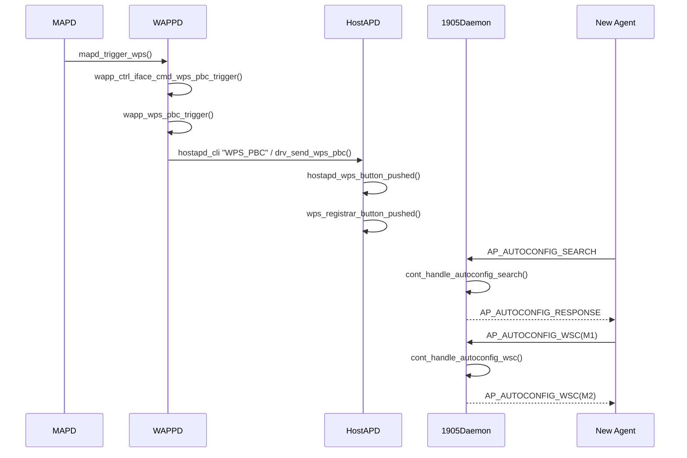
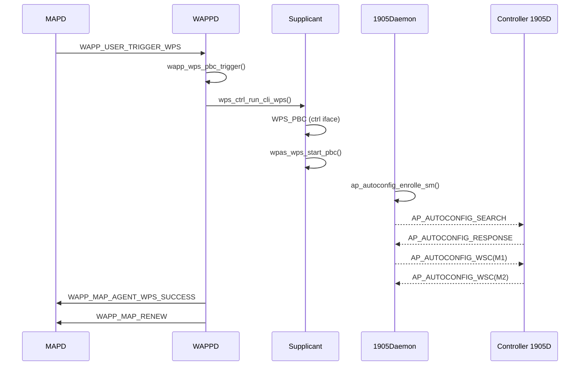
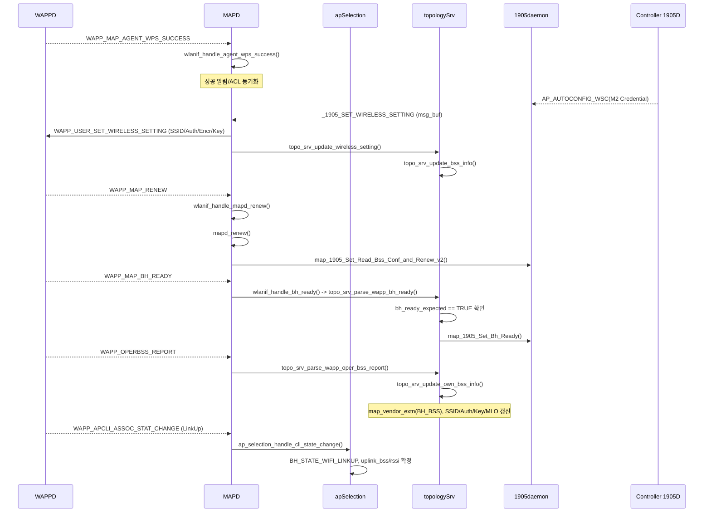
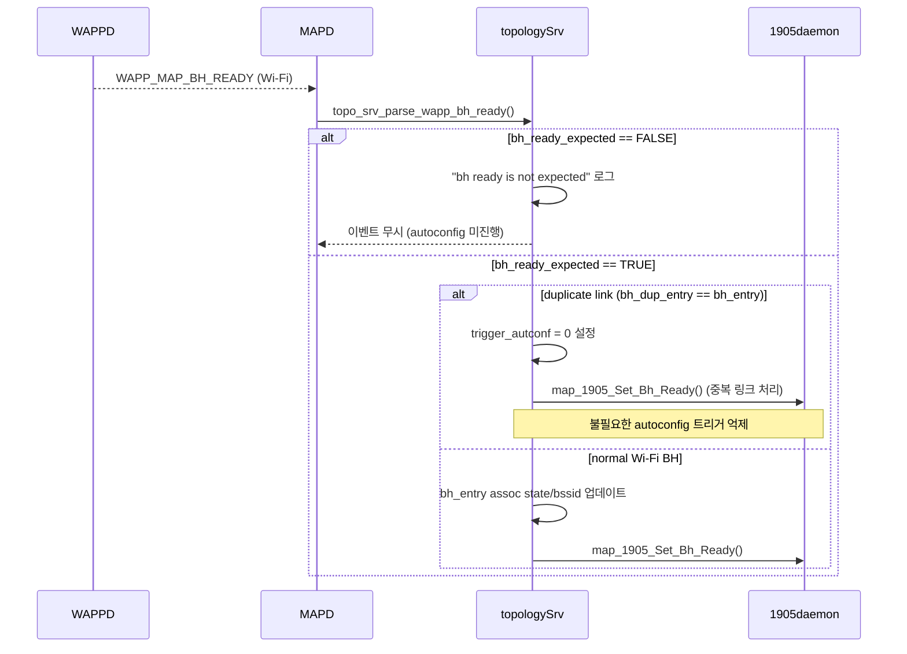

# WPS 온보딩 프로세스 정리 (AP MLD / bSTA MLD)

이 문서는 AP MLD/bSTA MLD 시나리오에서 WPS 온보딩 시 데몬 간 상호작용을 단계별로 정리한 내용이다.
기존 동작과 추가된 동작을 분리해, 디버깅/로그 추적 시 빠르게 참조할 수 있도록 구성했다.

## 1) 참여 모듈

- `MAPD`: EasyMesh 상위 제어, 설정 분배
- `1905D`: IEEE 1905.1 메시지 처리, Topology/Autoconfig 교환
- `WAPPD`: 무선 설정 트리거/중개
- `Supplicant` 또는 `HostAPD`: WPS 트리거/온보딩 수행
- `Driver`: 최종 BSS 파라미터 반영
- `Controller`: 토폴로지/오토컨피그 응답 제공 (컨트롤러 역할 노드)

## 2) Enrollee Agent 측 WPS 온보딩 흐름

아래는 "새 Agent(Enrollee)"가 WPS로 설정을 받아오는 흐름이다.

1. `WAPPD`가 우선순위가 가장 높은 인터페이스에서 WPS를 트리거한다.
2. `WAPPD -> Supplicant`: AP 측 WPS 시작 요청 (`Multi_AP = 1` 조건).
3. `Supplicant -> Driver`: WPS Onboarding 수행.
4. `Supplicant -> Controller`: 연결 요청(Connection Request, NL 계열 이벤트).
5. 초기 인증/연결 후 BH(Backhaul) 준비 상태를 데몬 간 공유한다.
6. `1905D`는 Topology DB 정보를 교환하고 Autoconfig Response를 처리한다.
7. 각 라디오별 무선 설정(SSID/보안/키 등)을 반영한다.
8. 신규 확장 항목으로 다음 설정이 전달/적용된다.
   - `Early AP Capability bit`
   - `Early AP Capability Report`
   - `AP MLD Config`
   - `bSTA MLD Config`
9. `WAPP_MAP_RENEW -> oper_bss_report -> APCLI link state` 순서로 Backhaul 운영 정보(BH_BSS/uplink_bss/rssi/bh_assoc_state)를 업데이트한다.
10. 필요 시 bSTA가 재연결(disconnect/reconnect)하여 새 설정으로 붙는다.
11. 최종적으로 Driver가 BSS에 새 SSID/보안/키를 적용한다.

## 3) Controller 측 WPS 온보딩 흐름

아래는 "Controller 또는 이미 온보딩된 Agent"가 요청 Agent를 구성해 주는 관점이다.

1. `1905D -> WAPPD`: 2G/5G 동시(concurrent) WPS 트리거 이벤트 전달.
2. `WAPPD -> HostAPD`: AP WPS 트리거 (`Multi_AP = 1`).
3. `HostAPD <-> New Agent`: WPS Onboarding 절차 수행.
4. `1905D`는 다음 1905 메시지 흐름을 순차 처리한다.
   - Topology Information
   - AP-Autoconfig Search
   - AP-Autoconfig Response
   - Radio별 1905 Autoconfiguration
5. `MAPD/1905D`는 무선 BSS 설정 정보를 수집/정리한다.
6. `WAPP_MAP_RENEW` 이후 `oper_bss_report`/link state 이벤트를 통해 Agent의 Backhaul 상태가 갱신되는지 확인한다.
7. 신규 확장 항목을 포함해 정책을 전달한다.
   - `Early AP Capability bit`
   - `Early AP Capability Report`
   - `AP MLD Configuration`
   - `BSTA MLD Configuration`

## 4) 기존 대비 추가/변경 포인트

- `WPS trigger`가 단일 밴드 중심에서 다중 인터페이스/동시 트리거 중심으로 확장됨.
- `1905 Autoconfiguration` 응답에 MLD 관련 구성(`AP MLD`, `bSTA MLD`)이 명시적으로 포함됨.
- `Early AP Capability` 정보가 온보딩 초반에 제공되어, 후속 설정 결정을 앞당김.
- 온보딩 완료 후 드라이버 반영 시점까지의 데몬 체인이 명확히 분리됨.

## 5) 운영/디버깅 체크리스트

### Agent(Enrollee) 측

- `WAPPD`에서 WPS 트리거 인터페이스 선택 로그 확인
- `Supplicant`의 WPS 시작/완료 이벤트 확인
- `1905D`의 Autoconfig Response 수신 및 파싱 결과 확인
- `AP MLD Config`, `bSTA MLD Config` 수신 여부 확인
- 최종 Driver 설정 반영(SSID/보안/키) 성공 여부 확인

### Controller 측

- `1905D`에서 Search/Response 프레임 교환 순서 확인
- `HostAPD`의 WPS 세션 생성/종료 로그 확인
- Early AP Capability 정보 생성/전달 여부 확인
- Radio별 Autoconfig 메시지 누락 여부 확인

## 6) 간단 시퀀스(텍스트)

### Enrollee Agent

`WAPPD -> Supplicant -> Driver -> Controller -> 1905D -> (Wireless Settings/MLD Config) -> Driver apply`

### Controller

`1905D -> WAPPD -> HostAPD <-> New Agent -> 1905D Autoconfig -> MLD Config delivery`

## 7) 참고

- 본 문서는 제공된 다이어그램(Agent/Controller WPS message flow) 기반 요약이다.
- 실제 코드 추적 시 `mapd`, `1905daemon`, `wappd`, `hostapd/supplicant`, `driver` 로그를 같은 타임라인으로 정렬해서 보는 것을 권장한다.

## 8) 실제 데몬 함수 호출 체인 (코드 기준)

아래 항목은 `mapd`, `1905daemon`, `wappd` 소스에서 확인된 함수 기준이다.

### 8.1 Controller 관점

#### `1905daemon`

- `cont_handle_autoconfig_search(...)`
  - `insert_cmdu_txq(..., e_ap_autoconfiguration_response, ...)` 호출로 Search에 대한 Response 송신 큐잉
  - 파일: `1905daemon/src/p1905_ap_autoconfig.c`
- `cont_handle_autoconfig_wsc(...)`
  - `insert_cmdu_txq(..., e_ap_autoconfiguration_wsc_m2, ...)` 호출로 M2 송신 큐잉
  - 파일: `1905daemon/src/p1905_ap_autoconfig.c`
- `process_cmdu_rx(...)`
  - `AP_AUTOCONFIG_SEARCH/RESPONSE/WSC/RENEW` 수신 후 `parse_*` -> `cont_handle_*` 경로
  - 파일: `1905daemon/src/cmdu_message_parse.c`
- `cmdu_tx_msg(...)`
  - `e_ap_autoconfiguration_search/response/wsc_m2/renew`에 따라 `ap_autoconfiguration_*_message(...)` 생성
  - 파일: `1905daemon/src/cmdu.c`, `1905daemon/src/cmdu_message.c`

#### `mapd`

- `mapd_trigger_wps(...)`
  - 로컬 BSS: `wlanif_issue_wapp_command(..., WAPP_USER_TRIGGER_WPS, ...)`
  - 원격 Agent: `map_1905_Send_Vendor_Specific_Message(...)` (vendor TLV `FUNC_VENDOR_TRIGER_WPS`)
  - 파일: `mapd/mapd.c`
- `_1905_handle_vendor_msg(...)`
  - `FUNC_VENDOR_TRIGER_WPS` 수신 시 `mapd_trigger_wps(...)` 재호출
  - 파일: `mapd/src/1905_if/1905_if.c`

#### `wappd`

- `wapp_ctrl_iface_cmd_wps_pbc_trigger(...)` -> `wapp_wps_pbc_trigger(...)`
  - 파일: `wappd/common/ctrl_iface_unix.c`, `wappd/common/wapp_cmm.c`
- `wapp_wps_pbc_trigger(...)` (configured AP 경로)
  - `wps_ctrl_run_ap_wps(...)` -> `drv_send_wps_pbc(...)` 또는 `hostapd_cli ... wps_pbc`
  - 파일: `wappd/common/wapp_cmm.c`, `wappd/wps/wps.c`

### 8.2 Agent(Enrollee) 관점

#### `1905daemon`

- `ap_autoconfig_enrolle_sm(...)` (상태머신)
  - `wait_4_send_ap_autoconfig_search` 상태에서 `ap_autoconfig_search(...)`
  - `wait_4_send_m1` 상태에서 `insert_cmdu_txq(..., e_ap_autoconfiguration_wsc_m1, ...)`
  - 파일: `1905daemon/src/p1905_ap_autoconfig.c`
- 수신 처리: `process_cmdu_rx(...)`
  - `AP_AUTOCONFIG_RESPONSE` -> `parse_ap_autoconfig_response_message(...)` -> `cont_handle_autoconfig_response(...)`
  - `AP_AUTOCONFIG_WSC` -> `parse_ap_autoconfig_wsc_message(...)` -> `cont_handle_autoconfig_wsc(...)`
  - 파일: `1905daemon/src/cmdu_message_parse.c`

#### `mapd`

- `_1905_AUTOCONFIG_RENEW_EVENT`
  - `wlanif_issue_wapp_command(..., WAPP_USER_SET_RADIO_RENEW, ...)` 호출
  - 파일: `mapd/src/1905_if/1905_if.c`
- `_1905_AUTOCONFIG_SEARCH_EVENT` (R3 경로)
  - `wlanif_issue_wapp_command(..., WAPP_USER_SEND_AUTOCONFIG_TRIGGER, ...)` 호출
  - 파일: `mapd/src/1905_if/1905_if.c`
- `wlanif_handle_mapd_renew(...)` -> `mapd_renew(...)`
  - 파일: `mapd/src/dot11_if/wapp_if.c`, `mapd/mapd.c`

#### `wappd`

- `wapp_wps_pbc_trigger(...)` (unconfigured STA/Agent 경로)
  - `wps_ctrl_run_cli_wps(...)` -> `drv_send_wps_pbc(...)`
  - 파일: `wappd/common/wapp_cmm.c`, `wappd/wps/wps.c`
- `wdev_handle_wsc_eapol_end_notif(...)`
  - `wapp_send_1905_msg(..., WAPP_MAP_AGENT_WPS_SUCCESS, ...)` 전송
  - 파일: `wappd/common/wdev.c`
- `map_wps_conf_done_send_map_renew(...)`
  - `map_1905_send(..., WAPP_MAP_RENEW, ...)` 호출
  - 파일: `wappd/map/map_1905.c`

### 8.3 호출 순서 요약

- Controller:
  - `mapd_trigger_wps` -> `wapp_ctrl_iface_cmd_wps_pbc_trigger` -> `wapp_wps_pbc_trigger` -> `wps_ctrl_run_ap_wps`
  - `AP_AUTOCONFIG_SEARCH 수신` -> `cont_handle_autoconfig_search` -> `e_ap_autoconfiguration_response`
  - `AP_AUTOCONFIG_WSC(M1) 수신` -> `cont_handle_autoconfig_wsc` -> `e_ap_autoconfiguration_wsc_m2`
- Agent:
  - `ap_autoconfig_enrolle_sm` -> `e_ap_autoconfiguration_search` -> `AP_AUTOCONFIG_RESPONSE 수신`
  - `ap_autoconfig_enrolle_sm` -> `e_ap_autoconfiguration_wsc_m1` -> `AP_AUTOCONFIG_WSC(M2) 수신`
  - `wdev_handle_wsc_eapol_end_notif` -> `WAPP_MAP_AGENT_WPS_SUCCESS` -> `WAPP_MAP_RENEW`

### 8.4 추가 확인 필요 항목

- `WAPP_MAP_AGENT_WPS_SUCCESS` 이벤트가 최종적으로 어떤 1905 TLV/프레임으로 변환되는지의 끝단 발신 함수는 런타임 설정 경로에 따라 분기 가능성이 있어 추가 추적이 필요하다.
- R3 환경에서 `WAPP_USER_SEND_AUTOCONFIG_TRIGGER`가 `DPP` 경로와 `WPS` 경로를 어떻게 나누는지(설정 플래그/초기화 순서)는 config 초기화 코드까지 함께 확인하는 것이 안전하다.

## 9) 시퀀스 다이어그램 (보기 편한 요약)

### 9.1 Controller 관점 (AP/Registrar 측)

### 9.2 Agent 관점 (Enrollee/bSTA 측)

## 10) `hostapd-wpad-full-openssl` 추가 분석 결과

아래는 요청하신 `hostapd-2022-07-29-b704dc72` 기준으로 확인된 실제 WPS 함수 경로다.

### 10.1 AP(HostAPD Registrar) 경로

- Ctrl 명령 수신
  - `hostapd/ctrl_iface.c`
  - `WPS_PBC` 명령 처리 시 `hostapd_wps_button_pushed(hapd, NULL)` 호출
- AP 전역 WPS 버튼 처리
  - `src/ap/wps_hostapd.c`
  - `hostapd_wps_button_pushed(...)` -> `hostapd_wps_for_each(...)` -> `wps_button_pushed(...)`
  - `wps_button_pushed(...)` -> `wps_registrar_button_pushed(hapd->wps->registrar, ...)`
- Registrar 내부 PBC 활성화
  - `src/wps/wps_registrar.c`
  - `wps_registrar_button_pushed(...)`에서
    - PBC overlap 검사: `wps_registrar_pbc_overlap(...)`
    - Registrar 활성화: `selected_registrar=1`, `pbc=1`
    - 타이머 등록: `eloop_register_timeout(WPS_PBC_WALK_TIME, ...)`

정리 체인:
- `WPS_PBC` -> `hostapd_wps_button_pushed` -> `wps_registrar_button_pushed` -> PBC active/timer

### 10.2 STA(Supplicant Enrollee) 경로

- Ctrl 명령 수신
  - `wpa_supplicant/ctrl_iface.c`
  - `WPS_PBC` 명령 처리 시 `wpa_supplicant_ctrl_iface_wps_pbc(...)` 호출
- Enrollee WPS 시작
  - `wpa_supplicant/wps_supplicant.c`
  - `wpa_supplicant_ctrl_iface_wps_pbc(...)` -> `wpas_wps_start_pbc(...)`
  - `wpas_wps_start_pbc(...)`에서
    - 임시 네트워크 생성/설정 (`wpas_wps_add_network`)
    - `phase1`에 `pbc=1` 및 `multi_ap=1` 조건 반영
    - `WPS_EV_PBC_ACTIVE` 이벤트 발생
    - `WPS_PBC_WALK_TIME` 타임아웃 등록
    - `wpas_wps_reassoc(...)`로 재연결 시도

정리 체인:
- `WPS_PBC` -> `wpa_supplicant_ctrl_iface_wps_pbc` -> `wpas_wps_start_pbc` -> `wpas_wps_reassoc`

### 10.3 본 프로젝트(`mapd`/`wappd`/`1905daemon`)와의 연결 포인트

- Controller(AP) 측:
  - `wappd`가 `hostapd_cli WPS_PBC` 또는 드라이버 경유 PBC를 트리거
  - HostAPD 내부에서는 위 Registrar 체인으로 PBC 세션이 열림
- Agent(STA) 측:
  - `wappd`가 CLI WPS를 트리거하면 Supplicant에서 `wpas_wps_start_pbc` 경로로 진행
  - 이후 1905 Autoconfig(M1/M2) 교환은 `1905daemon` 상태머신(`ap_autoconfig_enrolle_sm`)과 연동

## 11) WPS 이후 Backhaul 업데이트 시점과 `BH Ready` 개념

`mapd` 관점에서 WPS 온보딩 중 backhaul 정보 업데이트는 단일 이벤트가 아니라, 아래 순서로 단계적으로 진행된다.

### 11.1 `BH Ready`는 무엇인가

- `WAPP_MAP_BH_READY` 이벤트는 `wlanif_handle_bh_ready()`를 통해 `topo_srv_parse_wapp_bh_ready()`로 전달된다.
- 이 이벤트는 "BH 링크가 올라와서 1905 autoconfig를 진행할 준비가 됨"을 의미하는 게이트 이벤트다.
- Wi-Fi BH 경로에서는 `ctx->bh_ready_expected == TRUE`일 때만 유효하게 처리된다.
  - `FALSE`이면 `"bh ready is not expected"` 로그 후 무시된다.

핵심 코드 포인트:
- `mapd/src/dot11_if/wapp_if.c`: `wlanif_handle_bh_ready()`
- `mapd/src/topologySrv/wappEvent.c`: `topo_srv_parse_wapp_bh_ready()`

### 11.2 WPS 이후 실제 backhaul 정보 갱신 타임라인

1. `WAPP_MAP_AGENT_WPS_SUCCESS` 수신  
   - 주로 성공 알림/ACL 동기화 성격이며, BH/BSS DB를 대규모로 갱신하는 지점은 아님.
2. `WAPP_MAP_RENEW` 수신 -> `wlanif_handle_mapd_renew()` -> `mapd_renew()`  
   - `map_1905_Set_Read_Bss_Conf_and_Renew_v2()` 호출로 renew/read 사이클 시작.
3. `oper_bss_report` 수신 -> `topo_srv_parse_wapp_oper_bss_report()` -> `topo_srv_update_own_bss_info()`  
   - 여기서 BSS/보안/키/MLO 및 `map_vendor_extn(BH_BSS 포함)`이 갱신됨.
4. APCLI link up/down 수신 -> `ap_selection_handle_cli_state_change()`  
   - `BH_STATE_WIFI_LINKUP/FAIL`, `bh_assoc_state`, `uplink_bss`, `rssi` 등 운영 상태가 확정됨.

즉, 실무적으로는 `WPS_SUCCESS`가 시작 신호이고, 실제 BH 정보 반영은 `RENEW -> oper_bss_report -> link state`에서 완료된다.

### 11.3 `BH Ready` 처리 시 상태 전이 포인트

- Ethernet BH (`bh_info->type == 0`)는 바로 `map_1905_Set_Bh_Ready()` 호출 가능.
- Wi-Fi BH는 다음 조건/동작을 탄다.
  - `bh_ready_expected` 검사
  - 기존 `bh_link_head`의 assoc state 초기화
  - 매칭되는 `bh_entry`의 `bssid`, `bh_assoc_state=WAPP_APCLI_ASSOCIATED` 갱신
  - `topo_srv_update_upstream_device(...)`로 upstream 정보 업데이트
  - `map_1905_Set_Bh_Ready(...)`로 1905에 BH ready 전달 (중복 링크 상황에서는 autoconfig trigger 제어)

### 11.4 디버깅 시 확인해야 할 로그/상태

- 이벤트 수신:
  - `WAPP_MAP_AGENT_WPS_SUCCESS`
  - `WAPP_MAP_RENEW`
  - `WAPP_MAP_BH_READY`
- 상태/플래그:
  - `ctx->bh_ready_expected`
  - `ctx->current_bh_state` (`BH_STATE_WIFI_BOOTUP`, `BH_STATE_WIFI_LINKUP`, `BH_STATE_WIFI_LINK_FAIL` 등)
  - `ctx->current_bh_substate` (`BH_SUBSTATE_CONNECT_WAIT`, `BH_SUBSTATE_IDLE` 등)
- DB 반영:
  - `topo_srv_update_own_bss_info()`에서 `map_vendor_extn`/BH_BSS 반영 여부
  - `ap_selection_handle_cli_state_change()`에서 link up 시 `uplink_bss` 반영 여부

## 12) `BH Ready` 포함 시퀀스 다이어그램

### 12.1 정상 흐름 (WPS 성공 -> BH Ready -> BH 정보 반영)

### 12.2 예외 흐름 (BH Ready 예상치 아님/중복 링크)

## 13) Credential(SSID/보안/키) 전달 구조

WPS 온보딩에서 `SSID/Auth/Encr/Key`는 1905 `AP_AUTOCONFIG_WSC`의 WSC Credential(M2)로 전달되고, 이후 mapd/wappd 내부 IPC로 적용된다.

### 13.1 Controller -> Agent (1905 WSC M2)

- `1905daemon/src/cmdu_message.c`
  - `ap_autoconfiguration_wsc_message(..., MESSAGE_TYPE_M2)`에서 M2 생성
- `1905daemon/src/cmdu_tlv.c`
  - `append_WSC_tlv(..., MESSAGE_TYPE_M2, config_data, ...)`
- `1905daemon/src/wsc_message.c`
  - `create_wsc_msg_M2(...)`에서 Credential 필드 구성
  - `ATTR_SSID_ID` <- `config_data->Ssid`
  - `ATTR_AUTHENTICATION_TYPE_ID` <- `config_data->AuthMode`
  - `ATTR_ENCRYPTION_TYPE_ID` <- `config_data->EncrypType`
  - `ATTR_NETWORK_KEY_ID` <- `config_data->WPAKey`

### 13.2 Agent 내부 반영 (mapd -> wappd)

- `mapd/src/1905_if/1905_if.c`
  - `_1905_SET_WIRELESS_SETTING` 수신 후
  - `wlanif_issue_wapp_command(..., WAPP_USER_SET_WIRELESS_SETTING, ..., buf, len, ...)`
  - `topo_srv_update_wireless_setting(global, buf, len)` 호출
- `mapd/src/topologySrv/topologySrv.c`
  - `topo_srv_update_wireless_setting()` -> `topo_srv_update_bss_info()`
  - `bss_config->Ssid/AuthMode/EncrypType/WPAKey`를 `bss DB`에 반영
- `wappd/map/map_1905.c`
  - `WAPP_USER_SET_WIRELESS_SETTING` 수신 시 `map_config_wireless_setting_msg(...)` 적용

### 13.3 Backhaul 전용 적용 경로

- `mapd/src/topologySrv/topologySrv.c`
  - `send_wapp_event_wireless_settings()`에서 `struct wsc_config` 생성
  - `AuthMode/EncrypType/WPAKey/Ssid/map_vendor_extension` 채워
  - `WAPP_USER_SET_BH_WIRELESS_SETTING`로 전달
- `wappd/map/map_1905.c`
  - `WAPP_USER_SET_BH_WIRELESS_SETTING` -> `map_config_bh_wireless_setting_msg(...)`
- `wappd/common/wdev.c`
  - `wdev_bh_sta_connect_wsc_profile()`에서 APCLI SSID/PSK/Auth/Encr 실제 적용

## 14) 운영 관점 확인법: Controller BH 연결 / Agent Client SSID-MAC

### 14.1 Controller: 어떤 Agent가 어떤 BH MAC으로 연결됐는지 확인

Controller `mapd`는 Agent별(`AL-MAC`)로 BH 링크 정보를 유지한다.

- Agent 식별 키:
  - `_1905_dev->_1905_info.al_mac_addr` (Agent AL-MAC)
- BH 연결 MAC 정보:
  - `bh_entry->neighbor_iface_addr` (Backhaul BSSID)
  - `bh_entry->connected_iface_addr` (Setup link APCLI-MAC)

관련 코드:
- `mapd/src/topologySrv/topologySrv.c`
  - `"BH Link Info for Agent ... AL-MAC"` 출력
  - `"Backhaul BSSID"`, `"Setup Link APCLI-MAC"` 출력

실행 방법:
- `mapd_cli /tmp/mapd_ctrl bh_info`
  - 구현: `mapd/mapd_ctrl/mapd_cli.c` -> `BH_INFO` 명령

### 14.2 Agent: Client가 어느 SSID에 붙었고 MAC이 어디 기록되는지

Agent에서는 STA 이벤트로 `sta_mac`/`bssid`를 받고, `bssid`를 기준으로 SSID를 역매핑한다.

1. 이벤트 파싱(원본)
- `mapd/src/topologySrv/tlv_parsor.c`
  - `assoc->sta_addr` <- STA MAC
  - `assoc->bssid` <- 연결 BSSID

2. SSID 매핑
- `topo_srv_get_bss_by_bssid(...)`로 `bss_info`를 찾고,
- `bss_info->ssid`를 통해 "어느 SSID에 연결됐는지" 판별
- 동일 파일에서 `mapd_user_wireless_client_join/leave(..., sta, bssid, ssid)`로 사용자 이벤트 전달

3. 런타임 DB 기록 위치
- `mapd/src/topologySrv/topologySrv.c`
  - `device->wlan_clients` (`connected_clients`)
  - `device->assoc_clients` (`associated_clients`)
- 저장 필드:
  - Client MAC: `client->client_addr`, `assoc_client->client_addr`
  - BSSID: `client->bss_addr`, `assoc_client->bss->bssid`
  - APCLI/BH 플래그: `is_APCLI`, `is_bh_link`
- SSID는 `assoc_client->bss`가 가리키는 `bss_info_db->ssid`에서 조회

### 14.3 빠른 체크 포인트

- Controller에서 BH 확인:
  - `bh_info` 출력의 `AL-MAC` <-> `Backhaul BSSID/APCLI-MAC` 매핑 확인
- Agent에서 Client 확인:
  - `sta_mac + bssid` 이벤트 확인
  - 해당 `bssid`의 `bss_info_db->ssid` 조회로 최종 SSID 확인
