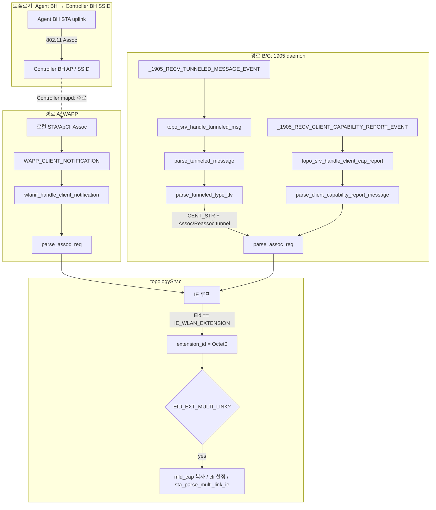
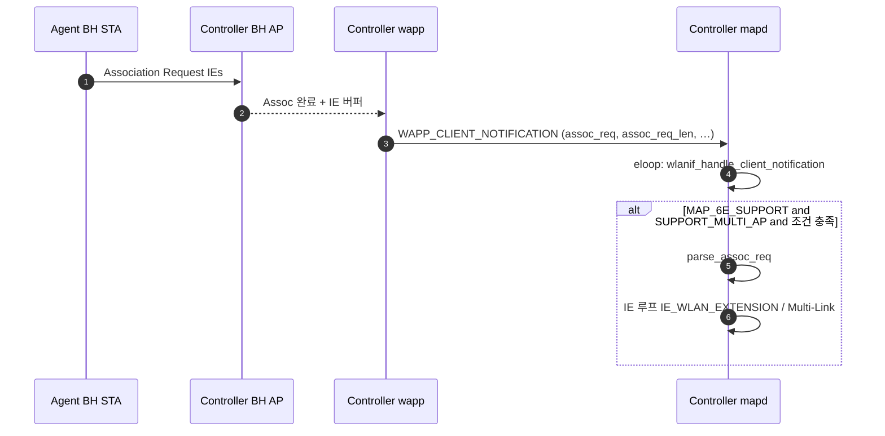
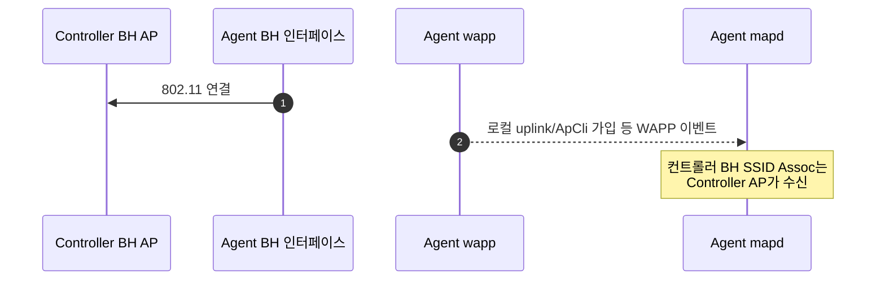
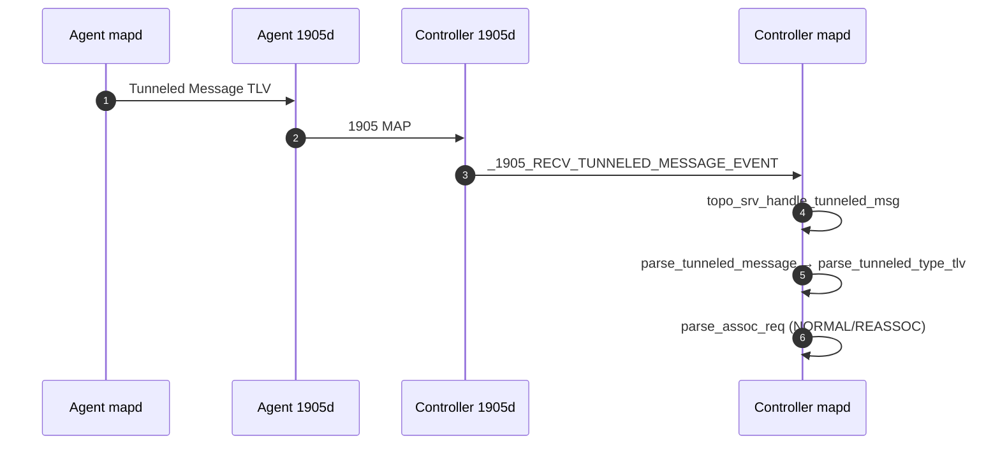
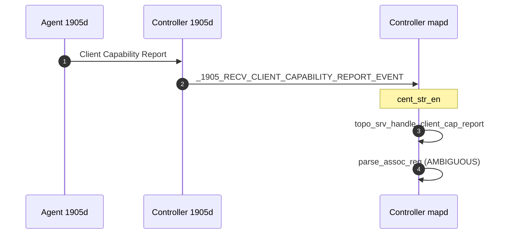

# `parse_assoc_req` — `IE_WLAN_EXTENSION` / Multi-Link 분기 이벤트 흐름

`topologySrv.c`의 Association Request IE 순회 중 아래 구간이 실행되는 조건과, 그에 이르는 상위 이벤트 체인을 정리한다.

```c
case IE_WLAN_EXTENSION:
    extension_id = eid_ptr->Octet[0];
    os_memcpy((void *)&mld_cap, &eid_ptr->Octet[10], sizeof(u16));
    switch (extension_id) {
    case EID_EXT_MULTI_LINK:
        /* ... */
```

해당 분기는 **`parse_assoc_req()`** 내부, Assoc/Reassoc 프레임(또는 동등한 IE 버퍼)의 **가변 IE 루프**에서 `eid_ptr->Eid == IE_WLAN_EXTENSION`일 때 진입한다.  
`extension_id == EID_EXT_MULTI_LINK`이면 Multi-Link 확장 IE로 간주하고 MLD 관련 필드 및 `sta_parse_multi_link_ie()` 호출로 이어진다.

**소스 기준 경로:** `mapd/src/topologySrv/topologySrv.c` (대략 L17232 `parse_assoc_req`, L17428 이후 IE 루프)

---

## 0. 배포 토폴로지: **컨트롤러 백홀 SSID ← 에이전트 백홀 STA**

아래와 같은 구성을 가정한다.

- **컨트롤러**가 백홀용 **BSS(SSID)** 를 제공한다.
- **에이전트**의 백홀 STA(일반적으로 ApCli / uplink, MLO이면 소속 링크·MLD에 해당)가 **그 SSID에 Association** 한다.

### 이 구조에서의 `parse_assoc_req` / 이벤트 소스

| 관점 | 설명 |
|------|------|
| **Assoc 프레임이 도착하는 곳** | 무선상으로는 **컨트롤러 쪽 BH AP**가 Assoc Request를 받는다. |
| **컨트롤러 mapd** | 동일 SoC의 **wapp**이 그 가입을 알리는 경로가 자연스럽다 → **경로 A (`WAPP_CLIENT_NOTIFICATION`)** 가 Assoc IE를 `parse_assoc_req`까지 넘기는 **주 경로**. |
| **1905** | 토폴로지·메트릭·정책 등 MAP 동기화에 사용. **CENT_STR**이면 **터널링된 Assoc**(경로 B)나 **Client Capability Report**(경로 C)로도 `parse_assoc_req`가 호출될 수 있으나, “에이전트 BH가 컨트롤러 BH SSID에 **직접** 붙는” 본 시나리오에서 **Assoc의 1차 소스는 컨트롤러 AP가 수신한 프레임**이므로, **반드시 1905를 거쳐야만** Assoc를 아는 구조는 아니다. |
| **에이전트 mapd** | 상향 링크는 **에이전트 측 wapp**(ApCli 가입 등) 이벤트가 중심. 컨트롤러 BH SSID에 붙는 Assoc 자체는 에이전트 mapd가 직접 파싱하지 않는다(드라이버 역할 분리). |

---

## 1. 공통: `parse_assoc_req()` 진입 조건

| 조건 | 설명 |
|------|------|
| `MTK_MLO_MAP_SUPPORT` | `IE_WLAN_EXTENSION` 분기 자체가 이 매크로로 감싸져 있다. |
| 유효한 Assoc/Reassoc 버퍼 | `sta_mac`, `bssid`, `assoc_req`, `assoc_len` 등이 호출자에서 넘어온다. |
| IE 루프 | 고정 필드 뒤의 `PEID_STRUCT` 연쇄를 `assoc_len` 범위 내에서 순회한다. |

---

## 2. 경로 A — 로컬 Wi‑Fi STA 가입: **WAPP → mapd**

### 트리거

- 드라이버/호스트 측 **wapp** 이 STA 연결(association) 시 **`WAPP_CLIENT_NOTIFICATION`** 메시지를 mapd로 보낸다.
- mapd의 WAPP 수신 처리에서 `eloop_register_timeout(0, 0, wlanif_handle_client_notification, global, buf)` 로 **지연 콜백**이 등록된다.

### 호출 스택 (요약)

1. `mapd/src/dot11_if/wapp_if.c` — `case WAPP_CLIENT_NOTIFICATION:` (~L4151)  
   → `eloop_register_timeout(..., wlanif_handle_client_notification, ...)`
2. `wlanif_handle_client_notification()` (~L2370)  
   - `pevt->assoc_evt` 가 join(비영)이고,  
   - **`MAP_6E_SUPPORT` + `SUPPORT_MULTI_AP`** 빌드에서  
   - `pevt->assoc_req_len != 0` 이고, `MAP_R6` 시 추가로 `is_setup_link_entry == 1` 또는 `ap_mld_addr` 가 zero 등 조건을 만족하면  
   → **`parse_assoc_req(global, pevt->sta_mac, pevt->bssid, pevt->assoc_req, pevt->assoc_req_len, ...)`** (~L2506)

### 특징

- Assoc IE 전체가 **wapp 이벤트에 실린 `pevt->assoc_req`** 로 전달된다.
- `parse_assoc_req` 호출부에서 **`pevt->is_APCLI`로 막지 않으므로**, 백홀 ApCli 가입도 동일 블록을 탈 수 있다(실제로 wapp이 `assoc_req_len`을 채워 주는지는 스택 구현에 따름).
- 로컬 장비 기준 AL MAC은 `MAP_R6` 분기에서 `global->dev.al_mac` 로 넘길 수 있다.

---

## 3. 경로 B — **MAP Tunneled Message** (Controller + CENT_STR)

### 트리거

- **1905 daemon** 이 **Tunneled Message** 관련 이벤트를 mapd에 올린다.
- `mapd/src/1905_if/1905_if.c` 에서 **`_1905_RECV_TUNNELED_MESSAGE_EVENT`** 처리 시  
  `topo_srv_handle_tunneled_msg(global, buffer, length)` 호출 (~L1535, `MAP_R2` 등 빌드에 포함).

### 호출 스택 (요약)

1. `topo_srv_handle_tunneled_msg()` — `mapd/src/topologySrv/topologySrv.c` (~L15658)  
   - **역할이 Controller** (`global->dev.device_role == DEVICE_ROLE_CONTROLLER`) 일 때만 계속 진행  
   → `parse_tunneled_message(&global->dev, buf, len, dev)`
2. `parse_tunneled_message()` — `mapd/src/topologySrv/tlv_parsor.c` (~L2396)  
   - SOURCE_INFO / TUNNELED_MESSAGE_TYPE / **TUNNELED_TYPE** TLV를 순서대로 파싱  
   → `parse_tunneled_type_tlv(..., tunnel_type, dev)`
3. `parse_tunneled_type_tlv()` (~L2362)  
   - **`CENT_STR`** 이고 `tunnel_type` 이 **`ASSOC_REQ_NORMAL`** 또는 **`ASSOC_REQ_REASSOC`** 이면  
   → **`parse_assoc_req(..., temp_buf, length, ..., tunnel_type, dev->_1905_info.al_mac_addr)`**  
   - `temp_buf` 는 Tunneled payload 안의 **Assoc/Reassoc IE 본문**이다.  
   - 호출 직전 **`cli->is_remote = 1`** 설정.

### 특징

- 원격 에이전트가 터널링한 **Assoc/Reassoc** 이 Controller 쪽 CENT_STR에서 파싱될 때, 동일한 `parse_assoc_req` IE 루프가 돈다.

---

## 4. 경로 C — **Client Capability Report** (Controller + CENT_STR)

### 트리거

- 1905 **`_1905_RECV_CLIENT_CAPABILITY_REPORT_EVENT`** (`1905_if.c` ~L1612, `#ifdef CENT_STR`).
- `mapd_ctx->dev.cent_str_en` 이 참일 때만 처리.

### 호출 스택 (요약)

1. `topo_srv_handle_client_cap_report()` — `topologySrv.c` (~L17591)  
   - Agent 역할이면 즉시 return  
   - `parse_client_capability_report_message()` 로 TLV에서 **STA MAC, BSSID, assoc_req[]** 추출  
   → **`parse_assoc_req(global, temp_sta, temp_bssid, assoc_req, assoc_len, channel, band, ASSOC_REQ_AMBIGUOUS, al_mac)`** (~L17644)

### 특징

- Assoc 포맷이 모호할 수 있어 **`ASSOC_REQ_AMBIGUOUS`** 로 넘긴 뒤, `parse_assoc_req` 초반에서 Reassoc 여부를 휴리스틱으로 판별한다.

---

## 5. `parse_assoc_req` 호출 **출처** 구분 (런타임 힌트)

전용 “source enum” 필드는 없지만, 인자로 상당 부분 구분 가능하다.

| 힌트 | 의미 |
|------|------|
| `assoc_req_format` 이 `ASSOC_REQ_NORMAL` / `ASSOC_REQ_REASSOC` | **경로 B (Tunneled)**. `tunnel_type` 그대로 전달. |
| `assoc_req_format` 이 `ASSOC_REQ_AMBIGUOUS` | **경로 A 또는 C**. |
| `ASSOC_REQ_AMBIGUOUS` + `MAP_R6` 의 `al_mac` | `al_mac` 이 **`global->dev.al_mac`** 과 같으면 **로컬 wapp(경로 A)** 가능성이 큼. **리포팅 디바이스의 AL MAC**(원격)이면 **경로 C** 가능성이 큼. (동일 AL MAC이 겹치는 복합 장비에서는 100% 단정은 어려움.) |
| Tunneled 직후 `cli->is_remote == 1` | **경로 B**에서 설정된 클라이언트 객체 힌트. |

---

## 6. 흐름도 (Mermaid — 전체 관계)



---

## 7. 시퀀스 다이어그램

### 7.1 컨트롤러 BH SSID에 에이전트 백홀 STA가 붙을 때 (Controller `parse_assoc_req` — **주: wapp**)

에이전트의 BH가 **컨트롤러 라디오의 BH BSS**에 연결되므로, **Assoc Request는 컨트롤러 AP가 수신**한다. 동일 SoC의 **컨트롤러 wapp → 컨트롤러 mapd** 가 Assoc IE를 넘기는 흐름이 일반적이다.



### 7.2 에이전트 측 상향 백홀 (Agent mapd — **로컬 wapp**)

컨트롤러 BH에 붙는 행위의 “클라이언트” 역할은 **에이전트**에서 수행되므로, **에이전트 mapd**는 주로 **에이전트 wapp**의 ApCli/uplink 이벤트를 본다. (컨트롤러로의 Assoc IE를 에이전트 mapd가 다시 파싱하는 것과는 역할이 다름.)



### 7.3 CENT_STR — **터널링된 Assoc** (Controller, 경로 B)

다른 BSS/에이전트에서 **Assoc를 1905로 터널링**해 컨트롤러가 파싱하는 MAP 시나리오. **배포 0절의 “직접 BH Assoc”와는 별 트랙**이다.



### 7.4 CENT_STR — **Client Capability Report** (Controller, 경로 C)



---

## 8. 정리 표

| 경로 | 이벤트 소스 | `parse_assoc_req`에 넘기는 Assoc 버퍼 출처 | **배포 0 (Agent BH → Controller BH SSID)** 에서의 위치 |
|------|-------------|----------------------------------------|----------------------------------|
| A | wapp | `map_client_association_event_local` 의 `assoc_req` / `assoc_req_len` | **Controller mapd**: BH BSS에 붙은 STA(에이전트 BH) 가입 시 **주 경로** |
| B | 1905 Tunneled Message TLV | 터널 payload 내 Assoc/Reassoc 본문 | CENT_STR·다른 BSS 클라이언트 등 **별 시나리오** |
| C | 1905 Client Capability Report | TLV 파싱 결과 `assoc_req[]` | 리포트 기반 파싱 시 |

**`topologySrv.c` 17429행 부근**은 위 **어느 경로로든** `parse_assoc_req`가 호출되고, Assoc IE 안에 **Extension IE(255) + 확장 ID Multi-Link** 가 있을 때 실행된다. 실제 빌드에서는 `MTK_MLO_MAP_SUPPORT`, `MAP_6E_SUPPORT`, `CENT_STR`, `MAP_R2` 등이 경로별로 게이트가 된다.

---

## 9. 참고 코드 위치 (빠른 점프)

| 내용 | 파일 | 대략 라인 |
|------|------|-----------|
| `parse_assoc_req` + `IE_WLAN_EXTENSION` | `mapd/src/topologySrv/topologySrv.c` | ~17232, ~17428 |
| `topo_srv_handle_tunneled_msg` | `mapd/src/topologySrv/topologySrv.c` | ~15658 |
| `topo_srv_handle_client_cap_report` | `mapd/src/topologySrv/topologySrv.c` | ~17591 |
| Tunneled → `parse_assoc_req` | `mapd/src/topologySrv/tlv_parsor.c` | ~2363 |
| WAPP join → `parse_assoc_req` | `mapd/src/dot11_if/wapp_if.c` | ~2506 |
| 1905 이벤트 디스패치 | `mapd/src/1905_if/1905_if.c` | ~1535, ~1612 |
| WAPP 메시지 등록 | `mapd/src/dot11_if/wapp_if.c` | ~4151 |

---

*문서: `bsoh-md-/19000N/easymesh/parse_assoc_req_extension_ie_event_flow.md` — `mapd` 트리 기준 분석. 시퀀스·토폴로지 절(0, 7)은 Agent BH → Controller BH SSID 구성을 반영해 갱신함.*
